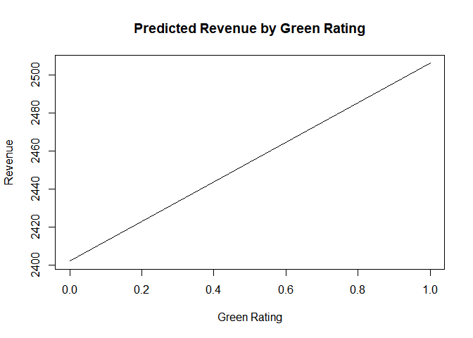
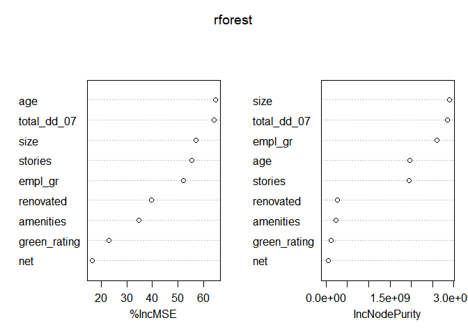

HW3
================
2023-03-20

## Green Buildings Prediction

### Using basic regression and step functions

For the purposes of this model, we chose to include 12 elements/element
combinations for our prediction of revenue. The most important to answer
the question is green rating, which tells if the building in question
either LEED- or EnergyStar-certified. We also chose to include variables
measuring utility cost, as well as if those costs are placed on the
tenant or the landlord. We declined to include rent and leasing rate
because our outcome variable, revenue, is the product of those two
variables. As such, including them in the model as independent variables
would result in perfect multicollinearity. We also looked at measures
such as the age, renovations, and amenities near the building. The
initial lm model that provided reasonable RMSE was:

$Revenue_i$ = $\beta_0$ + $\beta_1BuildingSize$ +
$\beta_2EmploymentGrowth$ + $\beta_3Age$ + $\beta_4Renovated$ +
$\beta_5Renovated*Age$ + $\beta_6GreenRating$ + $\beta_7Amenitie$s +
$\beta_8DaysUtilitesUsed$ + $\beta_9GasCost$ +
$\{beta_10}ElectricityCost$ + \$\_{11}UtilitiesPaidBy \$

Starting with this base model, we measured the RMSE using a
training/test split on the data. Then, in order to test different
variations of the model, we used step() to measure various interactions
on the data. The coefficients that were significant and therefore
included in the model are shown below, as well as their coefficients.
The RMSE of this model is lower than just the base model, but it still
seems as though we could do better. In order to test this, we move into
forest and boosted models.

    ## lm(formula = revenue ~ size + empl_gr + stories + age + renovated + 
    ##     green_rating + amenities + total_dd_07 + net + age:renovated + 
    ##     stories:age + stories:renovated + stories:amenities + age:amenities + 
    ##     empl_gr:age + renovated:amenities + size:age + size:renovated + 
    ##     empl_gr:stories + size:net + total_dd_07:net + size:green_rating + 
    ##     renovated:green_rating + age:total_dd_07 + empl_gr:net + 
    ##     empl_gr:total_dd_07 + stories:net + empl_gr:green_rating + 
    ##     green_rating:total_dd_07 + stories:age:renovated + age:renovated:amenities, 
    ##     data = gb_train)

    ##              (Intercept)                     size                  empl_gr 
    ##             3.035341e+03             1.577610e-03            -5.589691e+01 
    ##                  stories                      age                renovated 
    ##            -1.591912e+01            -6.775836e+00            -1.022797e+02 
    ##             green_rating                amenities              total_dd_07 
    ##             2.953054e+02             8.688423e+02            -1.899053e-01 
    ##                      net            age:renovated              stories:age 
    ##            -6.230603e+02             5.941877e+00             1.735762e+00 
    ##        stories:renovated        stories:amenities            age:amenities 
    ##            -1.285333e+01            -2.744201e+01            -1.295213e+01 
    ##              empl_gr:age      renovated:amenities                 size:age 
    ##            -3.795897e-01            -2.256051e+02            -1.808641e-05 
    ##           size:renovated          empl_gr:stories                 size:net 
    ##             7.922693e-04            -6.902511e-01            -1.978440e-03 
    ##          total_dd_07:net        size:green_rating   renovated:green_rating 
    ##             1.340766e-01            -4.338139e-04             3.531494e+02 
    ##          age:total_dd_07              empl_gr:net      empl_gr:total_dd_07 
    ##            -6.590248e-04            -6.212562e+01             1.129243e-02 
    ##              stories:net     empl_gr:green_rating green_rating:total_dd_07 
    ##             2.856539e+01             1.305099e+01            -6.476619e-02 
    ##    stories:age:renovated  age:renovated:amenities 
    ##            -1.027232e+00             1.080103e+01

### Using Tree/Boosted Models

In order to use the tree modelling, we measure a random forest model
using the same base model that we measured above. We also tested a
boosted model with an interaction depth of 4 and 200 trees. From these
models, it is clear that the model with the lowest RMSE is the random
forest model. A table showing the RMSE of each prediciton method is
shown below.

    ##   med_error step_error X1130.70757542877 X1125.25655106502 X735.202392177164
    ## 1  1545.869   1481.989          1130.708          1125.257          735.2024
    ##   X734.856890858713
    ## 1          734.8569

| med_error | step_error | X1130.70757542877 | X1125.25655106502 | X735.202392177164 | X734.856890858713 |
|----------:|-----------:|------------------:|------------------:|------------------:|------------------:|
|  1545.869 |   1481.989 |          1130.708 |          1125.257 |          735.2024 |          734.8569 |

### Partial Dependence - The Importance of the Green Rating

Fron this plot, it does appear as though green rating does cause an
increase in revenue - however, a rating of 1 only increases revenue
about \$100 from a rating of 0, so it is clearly not the most important
variables.

``` r
library(pdp)
p = pdp::partial(rforest, pred.var = 'green_rating', las = 1)

plot(p,type = "l", xlab = "Green Rating", ylab = "Revenue", main = "Predicted Revenue by Green Rating")
```

<!-- -->

The following variable importance plot helps us measure which variables
are very important in terms of prediction. In terms of increasing the
RMSE, age, size, employment growth, and days that utlities were used are
very important to predict this model. We can also see that green rating
is one of the less important prediction variables.

### Conclusion

From these test, it seems as though the forest model provided the best
RMSE in terms of of overall revenue prediciton. The green rating of a
building does not impact the revenue very much at all.

``` r
varImpPlot(rforest)
```

<!-- -->
